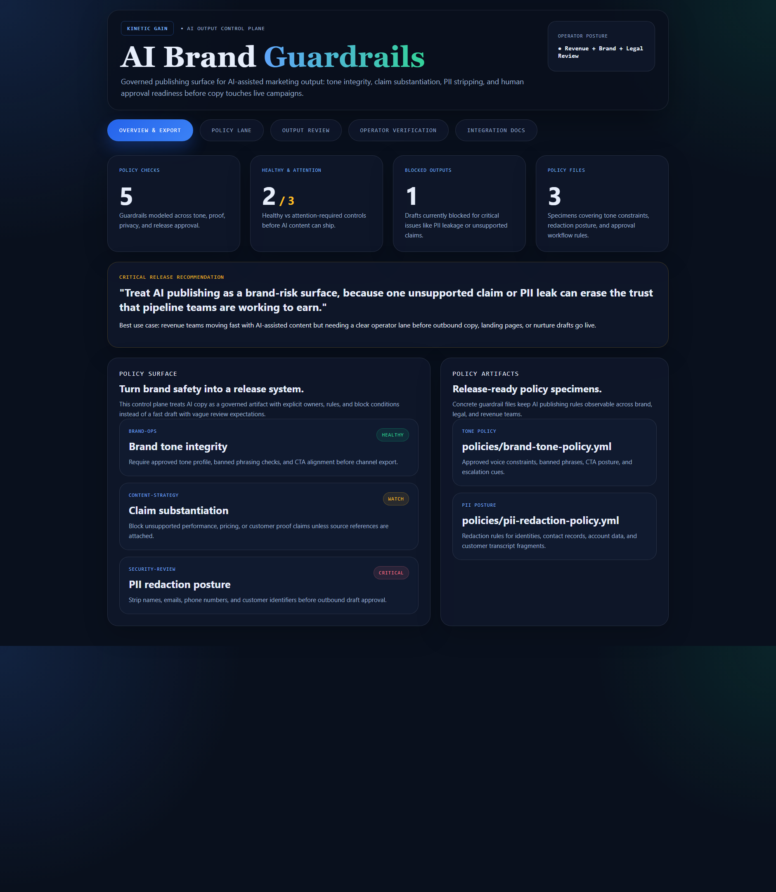
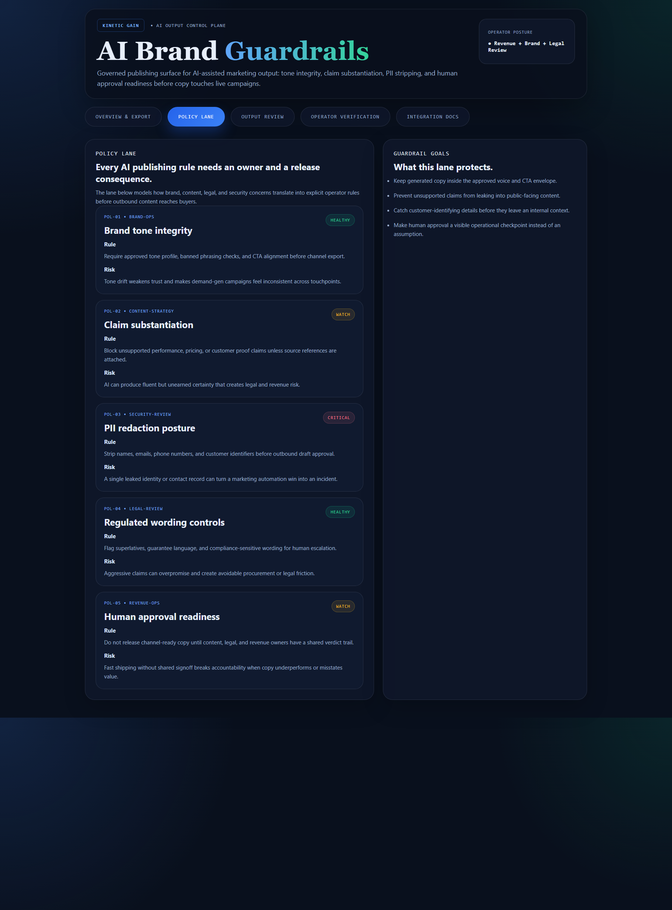
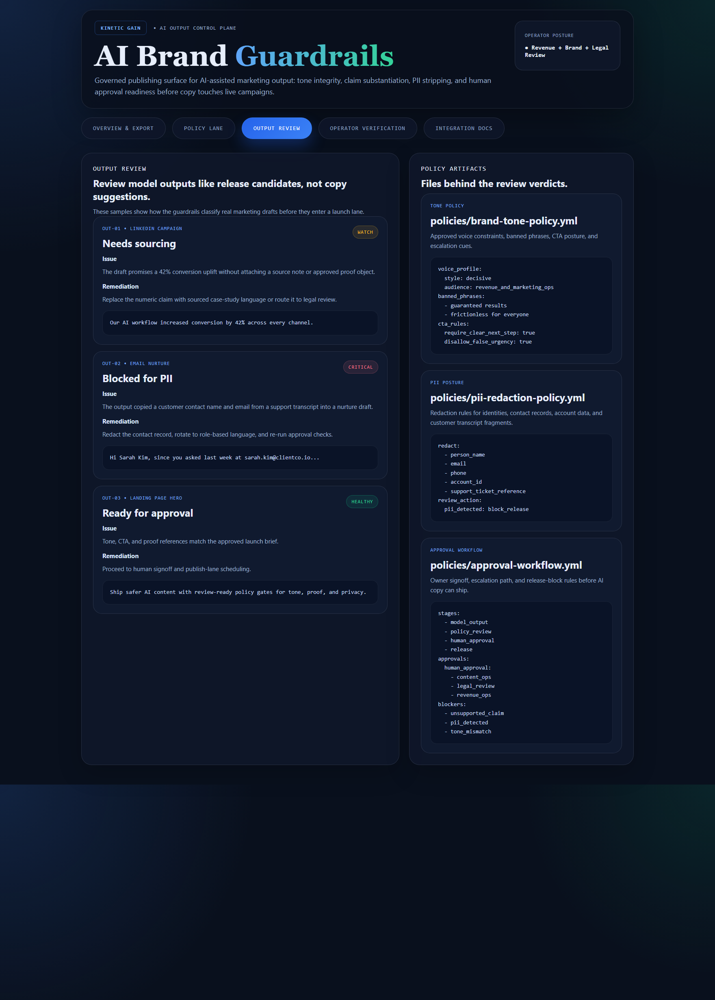

# ai-brand-guardrails

AI publishing control plane for brand-safe marketing output: tone integrity, claim substantiation, PII stripping, and approval readiness before generated copy reaches live campaigns.

## What it shows

- policy controls for tone, proof, privacy, and approval posture
- modeled output review decisions across campaign, email, and landing-page channels
- concrete policy artifacts for brand tone, PII redaction, and human approval workflow
- operator verification for AI-assisted release safety

## Screenshots

### Overview



### Policy Lane



### Output Review



## Routes

- `/`
- `/policy-lane`
- `/output-review`
- `/verification`
- `/docs`

## API

- `/api/dashboard/summary`
- `/api/policy-lane`
- `/api/output-review`
- `/api/policy-artifacts`
- `/api/verification`
- `/api/sample`

## Local development

```powershell
cd ai-brand-guardrails
npm install
npm run dev
```

Then open:

- `http://127.0.0.1:5418/`
- `http://127.0.0.1:5418/policy-lane`
- `http://127.0.0.1:5418/output-review`
- `http://127.0.0.1:5418/verification`
- `http://127.0.0.1:5418/docs`

## Validation

```powershell
npm run verify
npm run render:assets
```

## Documentation

- [docs/architecture.md](./docs/architecture.md)
- [docs/ORIGIN.md](./docs/ORIGIN.md)
